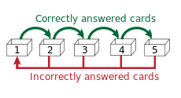
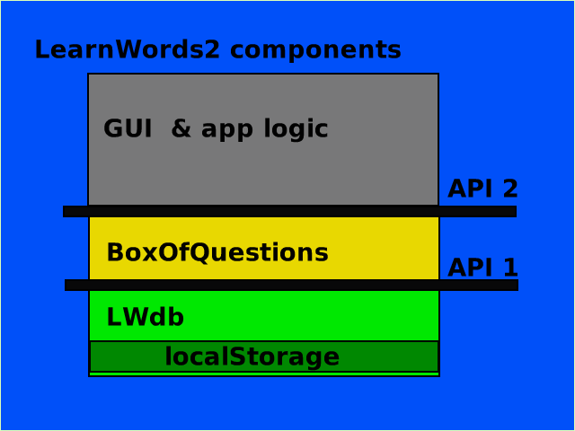
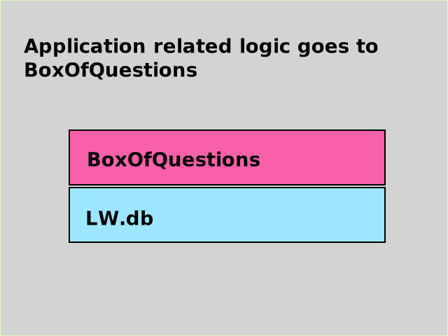

# LearnWords2
A vocabulary learning component for flash cards implementing the Leitner system

## Aim

The aim of the project is twofold
1. Provide a JavaScript library called ``LW.js`` which maintains and uses a collection of vocabulary questions in a database. "Database" means here JSON data to be kept in the localStorage.
2. Provide data conversion and report functions for lists of words to learn (the JSON files). This includes the conversion to the [Anki](https://apps.ankiweb.net/) file format.

It also provides a simple demo GUI. 

## What does the library ``LW.js`` implement?
The library offers a learning session. Within that session a vocabulary question is  picked at random and then depending on the answer a new date is noted for the question to be asked again. The time interval increases if the question has been answered correctly. To do this a step (or level) value is maintained for each question to determine the time period after which the question might be asked again.

This is known as [spaced repetition](https://en.wikipedia.org/wiki/Spaced_repetition).


It is as well possible to do the selection of questions according to tags given to each vocabulary entry.

The library implements the two lower levels as shown in the diagram:



## Reports

This repository includes CLI programs to generate HTML and LibreOffice Draw reports for  flash cards to be printed.


# Setup and usage

## Installation of the development environment
The command ``grunt-cli`` is a prerequisite.

Global installation is done with

````	
npm install -g grunt-cli
````


Installation of LearnWords2 repository

````	
git clone https://github.com/hhzl/LearnWords2.git
cd LearnWords2
npm install
grunt
````

Note: 
The ``grunt`` command generates the files in the ``dist`` directory. These JavaScript files are the debug and minified versions of the LearnWords2 library (``dist/LW.js`` and ``dist/LW-debug.js``). They are copied to the ``public/js`` directory so the demo and Jasmine tests are using the "latest version" (i.e. derived from the JavaScript in ``src``) of the library. The directory `public/data/json` contains the output data to be used by the library.

Draft of more documentation [here](https://github.com/hhzl/LearnWords2/blob/master/docs/Developer_notes.md#2018-01-30). 

## Use of the library ``LW.js`` in client program

To use the library you just need to copy ``LW.js`` to the code repo of your app and add it as follows.

```
<script src="<path>/LW.js"></script>
```
The file ``public/demo.html`` illustrates this.


## API of ``LW.js``



- LWdb is the data access layer.
- LWBoxOfQuestions contains the application logic for a Leitner box


Code:

````JavaScript
"use strict";
var lw = function(){

	var db = LW.LWdb('learnWords');

	var box = LW.BoxOfQuestions(db);
         
        // configuration

        .......

        box.importFrom(wordlist);

	return box;
}();

````

The construction above (IIFE) returns the BoxOfQuestions object ready for use.


If there is no configuration of the db you could as well just do


````JavaScript
var lw = LW.BoxOfQuestions(LW.LWdb('learnWords'));
    lw.importFrom(wordlist);

````


Then access to everything goes through  ``lw.method()``.

````JavaScript

lw.importFrom(....);

lw.question();

lw.answer();
lw.answerOptions();

lw.moveQuestionBackwards();

lw.moveQuestionForward();

````

 
Note: If `lw.moveQuestionBackwards()` and `lw.moveQuestionForward()` are called repeatedly on the same question it has only an effect the first time. The next time `lw.question()` is called a new question is provided.

TODO: Add more usage examples.


## Input data

Input data are CSV files with words and pictures in the directory `data/csv`.


## Export data

Export data in as HTML report and Anki database are generated and put into `public/data`.
The data to be used by the library is in `public/data/json`.


## Specification and tests with Jasmine

### In the browser

- on the command line do

     ```
     grunt
     ```

- then a browser window will launch and bring you to a Jasmine test harness page
  which is usually [http://localhost:8000](http://localhost:8000)


### On the command line with node

     npm test


## Credits

Anatol Marezhanyi, for the https://github.com/e1r0nd/LearnWords project
which implements data storage, Leitner box mechanism and a GUI. That project is under reconstruction.

This project here is based on ideas and originally on code from LearnWords but has a different aim:
1. It implements the non-gui part only to allow other projects to use the [SRS](https://github.com/repeat-space/srs-knowledge) and datastorage part as a library
2. It adds data conversion functions to be used through a CLI for word list preparation and production of printed flash cards.
3. Most of it is rewritten.
4. It uses Jasmine tests.


## Status

* Jasmine specs are set up and work both in the browser and on the command line.
* The LWdb (database layer) specification is set up and implemented with an MVP set of specs. 
* [release 0.2.2-beta](https://github.com/hhzl/LearnWords2/releases/tag/v0.2.2-beta) has a MVP implementation for the Leitner box and may be used for development work.
* Documentation [update](https://github.com/hhzl/LearnWords2/blob/master/docs/Developer_notes.md) in progress
* release 0.3.1 will come soon.
