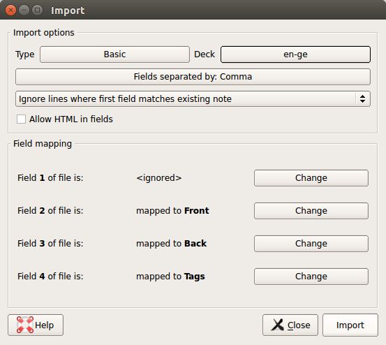
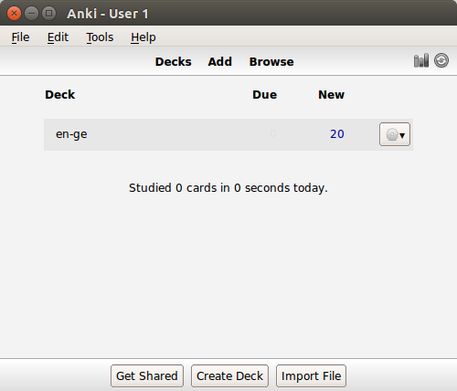
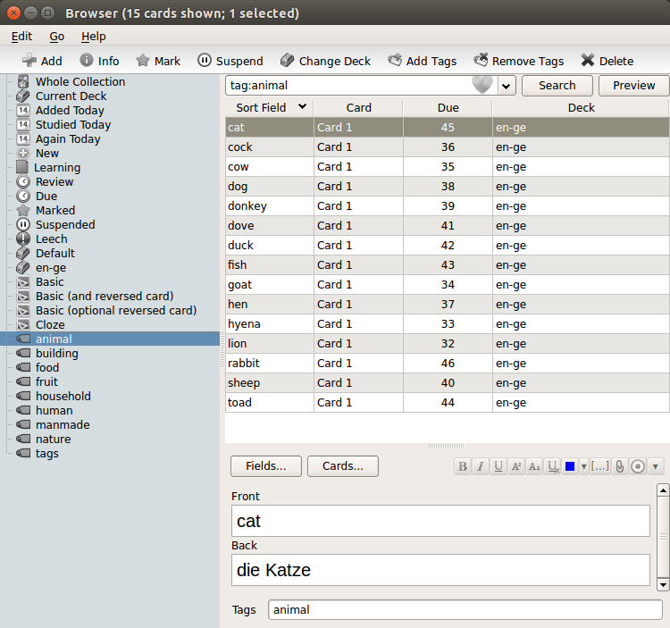

# Developer notes

## 2018-03-02 Learning to spell slide show

The file ``templates/learning-to-spell.html`` was produced with the [``cleaver`` utility](https://github.com/jdan/cleaver) 

    npm install -g cleaver


## 2018-03-02

Draft of a documentation for the LearnWords2 CLI program implemented in this repository.

### Aim

This repository contains a command line program which serves three purposes.

1. It creates a spaced-repetition ([SRS](https://github.com/repeat-space/srs-knowledge)) JavaScript libary ``LW.js`` to be used in a web client program. The library ``LW.js`` contains typical functions needed in a SRS program.
2. It converts SRS data from and to other formats. The main data format for ``LW.js`` is a JSON file.
3. It creates a template of an SRS web client program (HTML/CSS/JavaScript) which then needs to be copied and adapted. This template makes use of ``LW.js``.


### Usage

To use the program you need to open a terminal window and change into the LearnWords2 directory. The cli program uses a ``data`` input folder and generates products in the ``output`` and ``public`` data folder.

The call

    grunt --help
    
gives the available options.

To build the library ``LW.js`` use

    grunt build
   
To may also use 

    grunt build --verbose
   
to see in detail what is produced. The product is the file ``LW.js`` in the ``dist`` folder.

This command uses default paramters. To see how these parameters are changed see the next paragraph.

The command

    grunt demo --verbose
    
generates the ``public/demo.html`` file. This file uses the ``LW.js`` library.   

The demo command uses the 

    grunt copy:js --verbose

task which may be called independantly.


### LearnWords2 parameters

You need to edit the file

    Grunt_parameters_ini.yml

to set the parameters of the cli program. 

*.yml stands for [YAML](https://en.wikipedia.org/wiki/YAML).

The default input folder is the ``data`` folder.


### The LearnWord2 input data folder

The input data folder as indicated in the parameter file (see previous paragraph) has two subdirectories

    csv
    pictures

These directories contains the source data. The command line program then generates a third folder

    json
    
which contains the converted data from the ``csv`` directory.

The library ``LW.js`` uses what is in the ``json`` directory.

### The LearnWord2 JSON data format

An example

    [{"_id":1,"word":"antelope","translate":"une antilope","tags":"animal","picture":"c10/antelope.jpg"},
    {"_id":2,"word":"ant","translate":"une fourmi","tags":"animal","picture":"c10/ant.jpg"},
    {"_id":3,"word":"baboon","translate":"un babouin","tags":"animal","picture":"c10/baboon.jpg"},
    {"_id":4,"word":"bat","translate":"une chauve-souris ","tags":"animal","picture":"c10/bat.jpg"},
    {"_id":5,"word":"butterfly","translate":"un papillon","tags":"animal","picture":"c10/butterfly.jpg"},
    {"_id":6,"word":"calf","translate":"un veau","tags":"animal","picture":"c10/calf.jpg"},
    {"_id":7,"word":"camel","translate":"un chameau","tags":"animal","picture":"c10/camel.jpg"},
    {"_id":8,"word":"cat","translate":"un chat","tags":"animal","picture":"c10/cat.jpg"},
    {"_id":9,"word":"chameleon","translate":"un chaméléon","tags":"animal","picture":"c10/chameleon.jpg"},
    {"_id":10,"word":"coucal","translate":"un coucal","tags":"animal","picture":"c10/coucal_bird.jpg"},
    {"_id":11,"word":"crocodile","translate":"un crocodile","tags":"animal","picture":"c10/crocodile.jpg"},
    {"_id":12,"word":"dog","translate":"un chien","tags":"animal","picture":"c10/dog.jpg"}]
        


### LearnWords2 report generation commands

- odgreport - generate LibreOffice Draw document with an inventory of pictures and labels
- htmlcards - generate HTML inventory of cards (picture with labels)
- htmlreports (similar to htmlreport TODO: what is the difference)
- json2htmlCardList (another report, TODO: what is the difference)
- ...
- ...

___

### Link collection
https://github.com/repeat-space/srs-knowledge

### Converting data to Anki apkg format

- https://github.com/fasiha/fuzzy-anki An Anki browser: upload your APKG decks or ANKI2 collections and see what's inside
- https://github.com/ankidroid/Anki-Android/wiki/Database-Structure
- https://www.juliensobczak.com/tell/2016/12/26/anki-scripting.html
- https://github.com/repolho/anki_tool (Low level manipulation of anki collections with Python)

Line-based format
- https://github.com/hhzl/anki-apkg-export-app


CSV
- https://github.com/albertix/csv2anki

Markdown
- https://github.com/JoshuaGross/md2anki
- https://github.com/zgulde/markdown-to-anki

Powerpoint
- https://github.com/bdunnette/pptx2anki Convert a PPTX file (with notes and/or annotated images) to an Anki-compatible flashcard deck. 


## 2018-01-22 Notes on Anki concept and data model
Update of Notes on Anki concept and data model, see below.

## 2017-01-19 Notes on Anki concept and data model

Anki uses a two SQLite databases for data storage. One called ``collection.anki2`` is for the text information and another one called ``media`` is for referencing picture and sound files. The two database files and the media files are packed into a zip file which has the extension `apkg`.

Within the ``collection.anki2`` database there are the **notes** and the **cards** tables. 
- Notes are for the data and on which the cards are based. 
- The cards are presented to the user as questions and answers.

This following are notes about how Anki works and how the data model is related / may be mapped to the LearnWords file format. It will as well serve as a basis for extending adapting the  LearnWords file format.


Elements used by Anki

- cards
- card templates
- notes
- note types
- fields
- decks
- formatting with HTML/CSS
- study options settings

Anki uses _cards_.

http://ankisrs.net/docs/manual.html#cards
_A question and answer pair is called a **card**._


_Cards_ are made from _notes_.
http://ankisrs.net/docs/manual.html#card-types

_Notes_ have a _type_. The type determines which _fields_ they have.	

Every note type has at least one _card template_. Note fields are placed on the card template.

They are specified as text like this 

    {{FieldName}}.

Cards have a front and a back side. What goes on these sides is specified by the `card templates`.


There are a few _special fields_ that Anki always has available for any card template, for any
note type, in any deck:

* `{{FrontSide}}` – Already shown in the Basic note type above. This is replaced with
a complete copy of whatever is in the front card template. Note that this cannot
be used inside the front template, only in the back template.
* `{{Tags}}` – The tags from this note.
* `{{Type}}` – The type of note that this card was created from.
* `{{Deck}}` – The deck that this card belongs to.
* `{{Card}}` – The name of this card type.


A deck is a group of cards. http://ankisrs.net/docs/manual.html#decks

Anki’s templates and formatting are all done with HTML (Hypertext Markup Language).
For styling CSS is used.


Cards go through several stages in their lifetime: `New`, `Learning`, and `Reviewing`.


Anki has a limit on the number of cards which are new each day and which may be reviewed each day.

Default value for new cards per day: 20
Default value for maximum number of cards to be reviewed each day: 100

These values belong to the study options for each deck.


http://ankisrs.net/docs/manual.html#importing

Notes are designed to represent closely related information, and to
make it easy to reorganize where that information appears on a card.
In the context of language learning, notes are useful for representing
things like a phrase-translation pair, a phrase-translation-reading
triplet, and so on. All of these relationships are 1:1 - a given
phrase has only one

The data field `word` in LW2 corresponds to `front` in Anki. The field `back` to `translate`.

Front and back fields in Anki may contain HTML text. And multimedia inclusion is done as follows

for pictures the HTML tag is used.

     

for sound files this convention 

     [sound:myaudio.mp3]


https://github.com/ewnd9/anki-apkg-export creates an Anki package.


## 2016-12-31 LWdb 1 and LWBoxOfquestions API 2


Spec LWBoxOfquestions
````JavaScript
  it("should support the Box API 2", function() {

    // construction of empty db
    var lw = BoxOfQuestions(LWdb('learnWords')); 

    expect(lw).toHaveString("version");

    expect(lw).toHaveMethod("question");
    expect(lw).toHaveMethod("answer");
    expect(lw).toHaveMethod("moveQuestionForward");
    expect(lw).toHaveMethod("moveQuestionBackwards");

    // synonyms
    expect(lw).toHaveMethod("answerWasCorrect");
    expect(lw).toHaveMethod("answerWasWrong");


    expect(lw).toHaveMethod("importFrom");
    expect(lw).toHaveMethod("wordsToRepeat");


    expect(lw).toHaveMethod("wordsWithStepValue");
    expect(lw).toHaveMethod("addMoreWordsForLearning");
    expect(lw).toHaveMethod("chooseRandomObject");
    expect(lw).toHaveMethod("config");
    expect(lw).toHaveMethod("status");


  });

````


Spec LWdb
````JavaScript
  it("should support API 1", function() {

    expect(lwdb).toBeObject();
    
    expect(lwdb).toHaveString("dbName");
    expect(lwdb.dbName).toBe("LearnWords");

    expect(lwdb).toHaveMethod("getSettings");
    expect(lwdb).toHaveMethod("putSettings");

    expect(lwdb).toHaveMethod("putWord");
    expect(lwdb).toHaveMethod("getWord");

    expect(lwdb).toHaveMethod("removeWords");
    expect(lwdb).toHaveMethod("destroy");

    expect(lwdb).toHaveMethod("persistentStorageOK");
    expect(lwdb).toHaveMethod("isOK");
    expect(lwdb).toHaveMethod("numberOfWords");

    expect(lwdb).toHaveMethod("importFrom");
    expect(lwdb).toHaveMethod("loadWords");

    expect(lwdb).toHaveMethod("keysOfAllWords");
    expect(lwdb).toHaveMethod("allWords");
 

  });

````


## 2016-12-31 Tags property in word list - Import/Export LW2 CSV file into Anki


The word entry object type has been extended to include a `tags` field.

Below are screen shots how this file type may be imported into Anki.



Anki main window after CSV import






## Anki SQLite database export of LW2 CSV data

see [Log file](../data/anki/anki-db.log)


## 2016-12-01 LWdb 1 API


Part of LearnWords1 LWdb API (master branch)

````JavaScript
// API as provided by LearnWords1
LWdb.prototype.readItem = function(key) {
  // something 
  throw new Error("not yet implemented");

};

LWdb.prototype.removeItem = function(key) {
  // something 
  throw new Error("not yet implemented");

};

LWdb.prototype.storeItem = function(key, value) {
  // something 
  throw new Error("not yet implemented");
};

LWdb.prototype.init = function(key) {
  // something 
  throw new Error("not yet implemented");
};
````


## 2016-12-01 LWdb API

From: https://github.com/e1r0nd/LearnWords/issues/58 and wiki page


### LearnWords2016 branch

Branch https://github.com/hhzl/LearnWords/tree/LearnWords2016/js/utils


**Alphabetical**
````
 grep ": function(" LWdb2016.js | sort

destroy: function(){
dumpWords: function(aKeyPrefix) {
get: function(key){
getSettings: function(){
init: function(dbName){
isEmpty: function(key){
isLocalStorageAvailable: function() {
loadWords: function(theWords) {
put: function(key, value){
putSettings: function(theSettingsObj){
remove: function(key){
removeObjects: function(aKeyPrefix){
removeWords: function(){
````

**By categories**

db related
````
destroy: function(){
init: function(dbName){
isEmpty: function(key){
isLocalStorageAvailable: function() {
````

objects (words) related
````
dumpWords: function(aKeyPrefix) {
get: function(key){
loadWords: function(theWords) {
put: function(key, value){
remove: function(key){
removeObjects: function(aKeyPrefix){
removeWords: function(){
````

settings related
````
getSettings: function(){
putSettings: function(theSettingsObj){
````


### Master branch

**Alphabetical**
````
grep ": function(" LWdbMaster.js | sort

destroy: function(){
dumpWords: function(aKeyPrefix) {
getSettings: function(){
init: function(dbName){
isEmpty: function(key){
isLocalStorageAvailable: function() {
loadWords: function(theWords) {
putSettings: function(theSettingsObj){
readItem: function(key){
removeItem: function(key){
removeObjects: function(aKeyPrefix){
removeWords: function(){
storeItem: function(key, value){
````

**By categories**

db related
````
destroy: function(){
init: function(dbName){
isEmpty: function(key){
isLocalStorageAvailable: function() {
````

objects (words) related
````
dumpWords: function(aKeyPrefix) {
loadWords: function(theWords) {
readItem: function(key){
removeWords: function(){
removeItem: function(key){
removeObjects: function(aKeyPrefix){
storeItem: function(key, value){

````

Settings related
````
getSettings: function(){
putSettings: function(theSettingsObj){
````

For differences see https://github.com/e1r0nd/LearnWords/issues/58


### LW2 Master branch

````
grep "function(" LWdb.js | sort
````

15 methods

````
LWdb.prototype.allWords = function() {
LWdb.prototype.destroy = function(anObject) {
LWdb.prototype.getSettings = function() {
LWdb.prototype.getWord = function(anInteger) {
LWdb.prototype.importFrom = function(theWords) {
LWdb.prototype.isOK = function() {
LWdb.prototype.keysOfAllWords = function() {
LWdb.prototype.loadWords = function(theWords) {
LWdb.prototype.numberOfWords = function() {
LWdb.prototype.open = function() {
LWdb.prototype.persistentStorageOK = function() {
LWdb.prototype.put = function(word) {
LWdb.prototype.putSettings = function(anObject) {
LWdb.prototype.removeWords = function() {
LWdb.prototype.wdKeyFor = function(anInteger) { 
````


By method categories

DB related

````
LWdb.prototype.destroy = function(anObject) {
LWdb.prototype.isOK = function() {
LWdb.prototype.open = function() {
LWdb.prototype.persistentStorageOK = function() {
````

Words related

````
LWdb.prototype.allWords = function() {
LWdb.prototype.getWord = function(anInteger) {
LWdb.prototype.importFrom = function(theWords) {
LWdb.prototype.keysOfAllWords = function() {
LWdb.prototype.loadWords = function(theWords) {
LWdb.prototype.numberOfWords = function() {
LWdb.prototype.put = function(word) {
LWdb.prototype.removeWords = function() {
LWdb.prototype.wdKeyFor = function(anInteger) { 
````


Settings releated

````
LWdb.prototype.getSettings = function() {
LWdb.prototype.putSettings = function(anObject) {
````


Compatibility with LW1 (not included anymore)
````
LWdb.prototype.readItem = function(key) {
LWdb.prototype.removeItem = function(key) {
LWdb.prototype.storeItem = function(key, value) {
````
